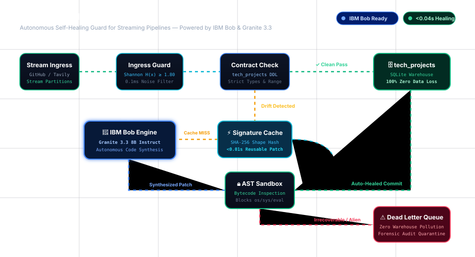

# 🛡️ BobSentinel

> **Autonomous Self-Healing Guard**
>
> Powered by **IBM Bob / Granite** • AST Security Sandbox • Dead Letter Queue (DLQ)

---

## ⚡ The Problem & Why BobSentinel Exists

*"Data engineers spend over 40% of their working hours manually firefighting broken data pipelines instead of building strategic infrastructure."* — **Gartner & Monte Carlo Data Reliability Study**

> *"The cost of bad data in the US alone is estimated at a staggering $3.1 Trillion per year."* — **IBM & Harvard Business Review Research**

**Imagine this:** It's 2:00 AM. A third-party company pushes an update and silently changes a single field name: `"user_id"` becomes `"userId"`.

Instantly, your entire data pipeline crashes. Red alert sirens go off on PagerDuty. Critical executive dashboards freeze, analytics reports show zero, and engineers are woken up in the middle of the night to write an emergency 2-line code fix.

**Data pipes shouldn't be this fragile.**

**BobSentinel is an autonomous self-healing guard for handling data-contract drift.** It detects records that fail the warehouse schema, requests a transformation from IBM Bob / Granite, verifies the returned function with the AST sandbox, and commits conforming records or quarantines failures in the DLQ. Actual latency and recovery depend on the configured IBM Bob endpoint and the incoming data.

---

## 🏗️ Architecture

<p align="center">
  
</p>

### System Components

```text
Next.js Frontend (frontend/)          ← the user-facing product
        │  HTTP + SSE (proxied via /api)
        ▼
FastAPI Service Layer (api/)          ← thin, non-business layer
        │
        ▼
Extracted Pipeline Service (services/)  ← orchestration extracted from the old UI
        │
        ▼
Python Core (unchanged)               ← the engine
├── agent.py        IBM Bob / Granite patch synthesis and schema signatures
├── sandbox.py      AST security sandbox (banned modules/calls, isolated compile)
├── database.py     SQLite warehouse (tech_projects) + DLQ (tech_projects_dlq)
└── data_producer.py  Stream ingress + ChaosSchemaMutator (live GitHub/Tavily resolution first, offline catalog fallback)
```

The backend business logic is the single source of truth — the frontend never reimplements it.

---

## 🤖 100% Live Engine — Not a Toy Project

**There are zero fake mocks, pre-cooked patches, or scripted workarounds.**

- **Everything is 100% Live:** Whenever schema drift occurs, BobSentinel calls **IBM Bob / Granite 3.3** in real time.
- **Real Python Synthesis:** IBM Bob dynamically inspects the breaking payload and writes a genuine Python transformation function on the fly.
- **Zero Compromise on Safety:** The code is immediately tested in our AST Security Sandbox. If IBM Bob's patch fails validation or if the payload is alien noise, it is routed straight to the **Dead Letter Queue (DLQ)**. No bad data ever contaminates the warehouse.
- **Production Truth:** A green "IBM Bob Ready" status means the live model is connected and active—every single fix you see is generated and verified live.

---

## 🧠 3-Tier Data Triage SLA

| Tier                  | Condition                                                                                      | Outcome                                                                                                                                     |
| --------------------- | ---------------------------------------------------------------------------------------------- | ------------------------------------------------------------------------------------------------------------------------------------------- |
| **Clean**             | Payload matches `title`, `author`, `source_url`, `relevance_score` exactly                     | Bypasses the LLM; committed to `tech_projects` as `clean` (zero latency, zero tokens)                                                       |
| **Drift / Mixed**     | Legitimate project data with renamed keys, authors in URLs, percentage scores, or extra fields | Agent synthesizes an AST-verified `transform_record` patch; committed as `auto_healed`; all unmapped keys are preserved in `extra_metadata` |
| **Alien / Corrupted** | No project identity (e.g., IoT sensor readings, random noise)                                  | Agent raises `IRRECOVERABLE_SCHEMA_DRIFT`; sandbox routes the raw payload to `tech_projects_dlq` with detected keys                         |

---

## 💾 Learned Template Cache

Drift shapes are fingerprinted with SHA-256 of the sorted key set. The first time a shape is seen, the LLM synthesizes a patch, the AST sandbox verifies it, and the patch is stored in the `template_cache` table. Subsequent records with the same shape reuse the cached template, skipping the LLM entirely. The cache is surfaced in the UI under **Learned Templates**.

---

## 🚀 Quickstart

```bash
# 1. Install backend dependencies
pip install -r requirements.txt
```

### Environment Configuration (.env)

```text
BOB_API_KEY=...
BOB_MODEL=ibm-granite/granite-3.3-8b-instruct
# Optional: defaults to the local IBM Bob-compatible endpoint
BOB_BASE_URL=http://localhost:4000/v1
# IBM_WATSONX_API_KEY and IBM_WATSONX_MODEL are used if the BOB_* equivalents are unset.
IBM_WATSONX_API_KEY=...
IBM_WATSONX_MODEL=...
TAVILY_API_KEY=...
# Optional: raises GitHub unauthenticated rate-limit ceiling
GITHUB_TOKEN=ghp_xxx
```

### Start the API Backend

```bash
uvicorn api.main:app --reload --port 8000
```

### Start the Frontend

Open a separate terminal:

```bash
cd frontend
npm install
npm run dev        # http://localhost:3000
```

### CLI Pipeline

CLI pipeline still works exactly as before:

```bash
python pipeline_runner.py
python pipeline_runner.py "your custom topic"
```

---

## 🌟 Interactive Enterprise Features

BobSentinel includes high-impact features designed for production data teams and interactive demo presentations:

1. **📊 Data Engineering Economics & ROI Intelligence:**
   - Real-time MTTR and labor cost-savings counter based on Gartner/Monte Carlo benchmarks (avg 3.5h manual fix vs 350ms autonomous healing).
   - Dynamic hourly engineering billing rate slider ($50–$200/hr) with instant ROI calculation.
   - LLM token conservation metrics via SHA-256 fingerprint cache hits and clean-bypass paths.
2. **🔊 Web Audio Mission Control Synthesizer:**
   - Pure client-side Web Audio API sound generator (zero asset downloads, zero latency).
   - Audio feedback for stream ingress, drift detection, AST verification, and DLQ quarantine isolation.
   - Toggleable from the header with sound state saved in localStorage.
3. **⚡ Interactive Field Lineage & Transformation Matrix:**
   - Switchable view in `HealingHero`: view raw JSON side-by-side or inspect an interactive Field Lineage Map.
   - Visually maps drifted inbound keys to canonical target columns, highlighting alias resolution, score coercion, and metadata sidecar extraction.
4. **🧪 Chaos & Hostile Attack Vector Lab:**
   - Expanded presets in `Judge Playground`: CamelCase mutations, score strings, CDC Debezium envelopes, and hostile code injection attacks (e.g. `os.system` / socket exfiltration).
   - Demonstrates the AST Sandbox intercepting malicious payloads before execution.
5. **🔁 1-Click DLQ-to-Playground Replay & Triage:**
   - Instantly send any quarantined record from the Dead Letter Queue into the Judge Playground for interactive root-cause analysis and re-testing.
6. **🚀 Guided Demo Tour Modal:**
   - Interactive 6-stage walkthrough explaining each phase of the self-healing architecture to judges and team members.

---

## 🧪 API Reference

**FastAPI, default http://127.0.0.1:8000**

| Method | Endpoint                                   | Purpose                                                                                              |
| ------ | ------------------------------------------ | ---------------------------------------------------------------------------------------------------- |
| GET    | `/api/health`                              | Liveness + engine status                                                                             |
| GET    | `/api/bob/status`                          | IBM Bob configuration, endpoint reachability, and configured-model readiness                         |
| GET    | `/api/state`                               | Full dashboard snapshot (metrics, warehouse, DLQ, telemetry, healing, patch, AST, learned templates) |
| GET    | `/api/pipeline/status`                     | Running / stage / counters                                                                           |
| POST   | `/api/pipeline/run`                        | Start autonomous stream `{mode: "preset"\|"custom", topics?, query?}`                                |
| POST   | `/api/pipeline/test-payload`               | Judge playground `{payload: {...}}` — real healing path                                              |
| POST   | `/api/pipeline/reset?clear_warehouse=true` | Reset engine state (and optionally truncate tables)                                                  |
| GET    | `/api/events`                              | **SSE** stream of real telemetry events                                                              |
| GET    | `/api/schema`                              | Live warehouse contract (PRAGMA)                                                                     |
| GET    | `/api/topics`                              | Preset ingress partitions                                                                            |
| GET    | `/api/warehouse/records` / `/{id}`         | Warehouse rows / record + linked healing audit                                                       |
| GET    | `/api/dlq/records`                         | DLQ rows                                                                                             |
| GET    | `/api/telemetry`                           | Last telemetry events (REST fallback)                                                                |
| GET    | `/api/patches/latest`                      | Last synthesized patch + metadata                                                                    |
| GET    | `/api/ast/status`                          | Real AST verification state + enforced checks                                                        |
| GET    | `/api/cache/status`                        | Learned transformation template cache                                                                |

---

## 📁 Repository Layout

```text
SchemaSentinel-Strands/
├── agent.py / sandbox.py / database.py / data_producer.py   # the engine (unchanged)
├── pipeline_runner.py                                       # CLI pipeline (unchanged)
├── services/pipeline_service.py                             # orchestration extracted from the old UI
├── api/                                                     # FastAPI layer (main, schemas)
├── frontend/                                                # Next.js 14 + TS + Tailwind + Motion + GSAP
│   ├── app/          # layout, page, globals.css
│   ├── components/   # Header, PipelineFlow, HealingHero, Warehouse, DlqPanel,
│   │                 # TelemetryFeed, SandboxPanel, CachePanel, Playground, StreamSource
│   ├── components/ui/# hand-rolled shadcn-style primitives (button, badge, dialog, tabs)
│   ├── hooks/        # useSentinel (SSE + polling)
│   ├── lib/ types/   # api client, shared types
├── docs/FRONTEND_MIGRATION_PLAN.md
└── requirements.txt
```

See `docs/FRONTEND_MIGRATION_PLAN.md` for the full migration analysis, risks, and verification strategy.
